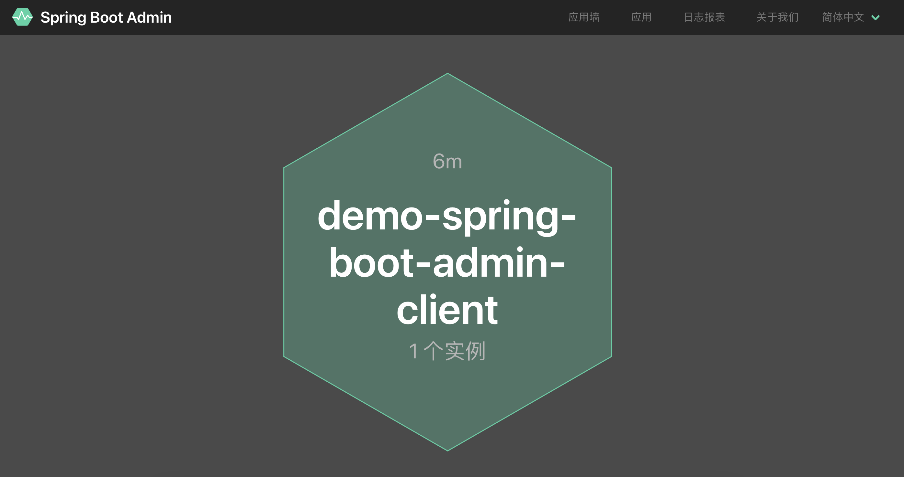
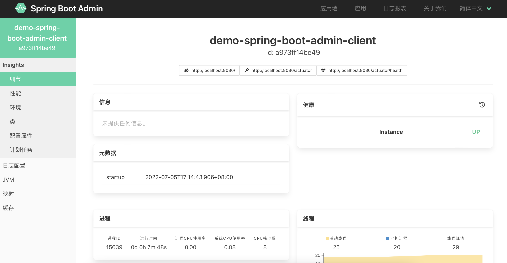

# Spring Boot Admin

当前版本：2.7.2

## 服务端

依赖：

```xml
<dependencies>
    <dependency>
        <groupId>de.codecentric</groupId>
        <artifactId>spring-boot-admin-starter-server</artifactId>
        <version>${spring-boot-admin.version}</version>
    </dependency>
    <dependency>
        <groupId>de.codecentric</groupId>
        <artifactId>spring-boot-admin-server-ui</artifactId>
        <version>${spring-boot-admin.version}</version>
    </dependency>
</dependencies>
```

启用

```
@EnableAdminServer
```

## 客户端

依赖：

```xml
<dependencies>
    <dependency>
        <groupId>org.springframework.boot</groupId>
        <artifactId>spring-boot-starter-web</artifactId>
    </dependency>
    <dependency>
        <groupId>org.springframework.boot</groupId>
        <artifactId>spring-boot-starter-actuator</artifactId>
    </dependency>
    <dependency>
        <groupId>de.codecentric</groupId>
        <artifactId>spring-boot-admin-starter-client</artifactId>
        <version>${spring-boot-admin.version}</version>
    </dependency>
</dependencies>
```

配置：

```yaml
spring:
  boot:
    admin:
      client:
        url: http://localhost:8901

management:
  endpoints:
    web:
      exposure:
        include: '*'
```

---

完成，启动服务，访问：

> http://localhost:8901

就可以看的服务信息


