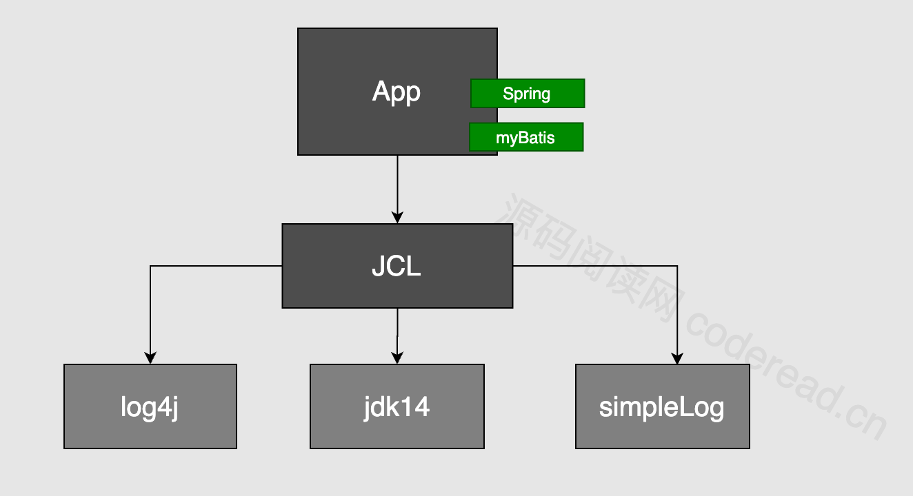
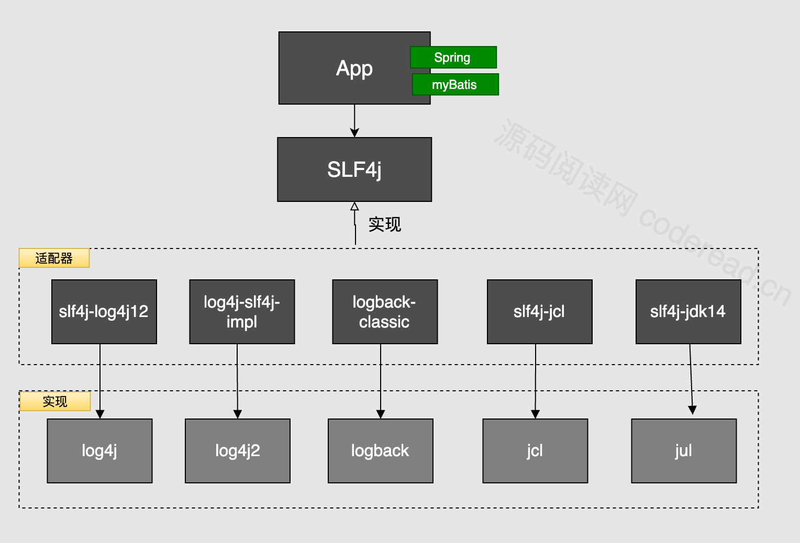
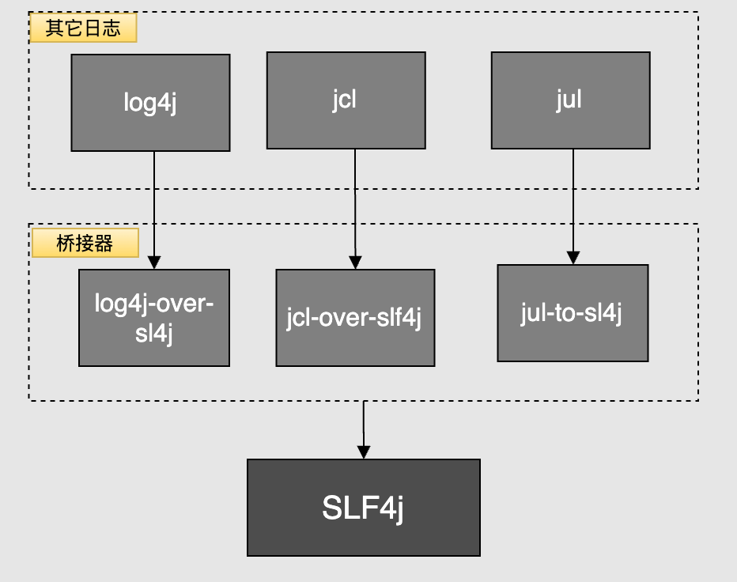
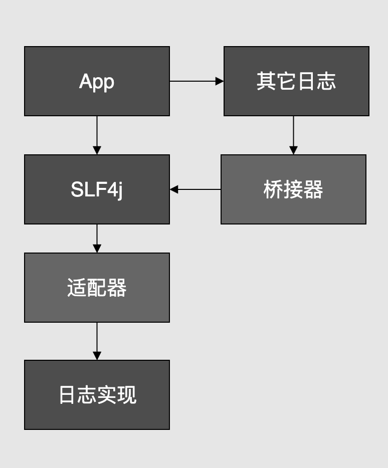
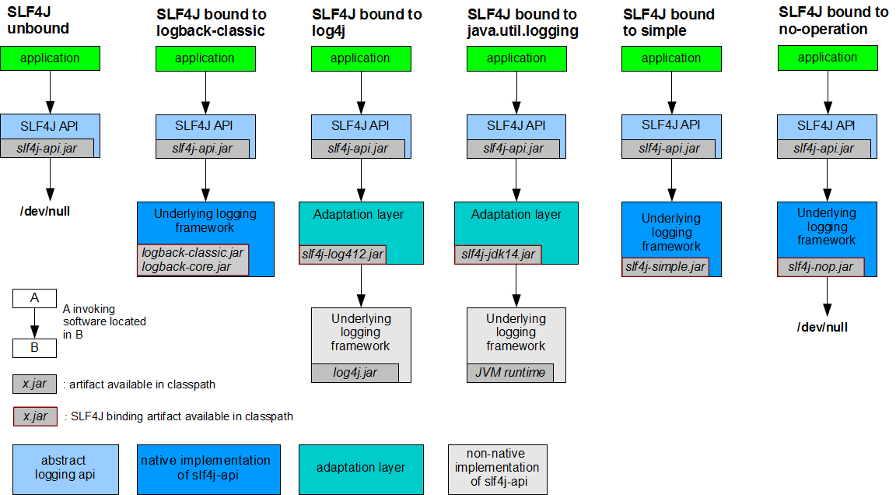
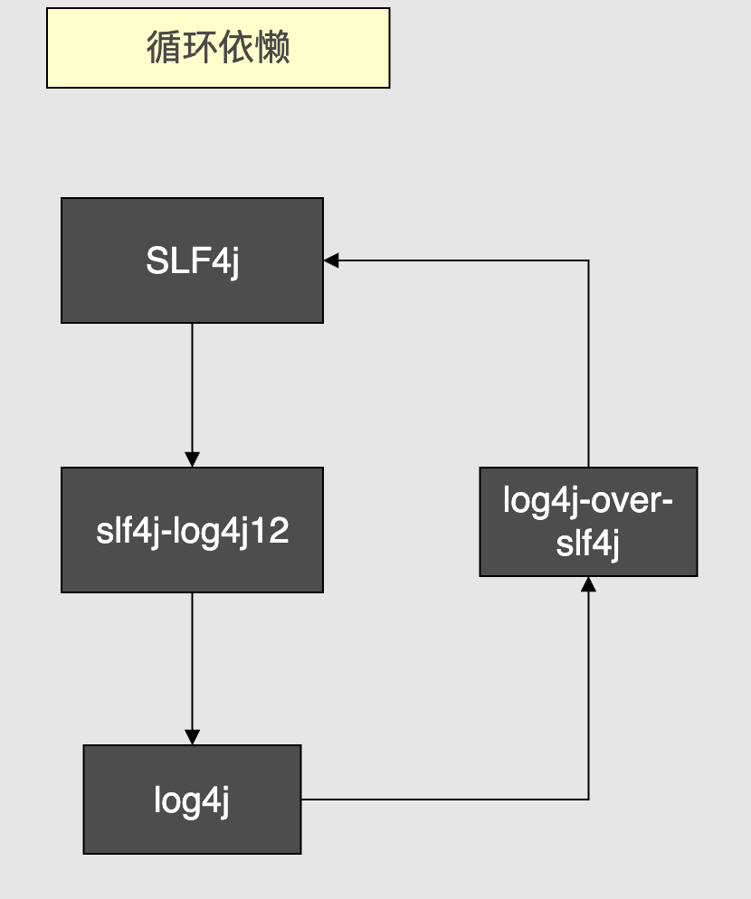

# 全面掌握JAVA日志体系

## 日志体系

| 名称                 | JAR                                          | 描述                             |
|--------------------|----------------------------------------------|--------------------------------|
| java.util.logging  | jdk(jul)                                     | Java1.4以来的官⽅⽇志实 现。⽆需第三⽅依懒      |
| log4j              | log4j-1.2.17.jar                             | 早期常⽤⽇志组件                       |
| log4j2             | log4j、log4j-api、log4j-core                   | apache开发的⼀款Log4j的升 级产品         |
| logback            | logback-core、logback-classic、logback-access  | ⼀套⽇志组件的实现,性能优 于log4j(slf4j阵营)。 |

## JCL

Commons Logging

Apache Commons Loging （JCL）

查找应⽤实际使⽤的⽇志组件，并适配打印正是 JCL ⼲的事 情。

Commons Loging 本身只提供⽇志接⼝，具体实现在运⾏时动态寻找对应组件？⽐如： log4j、jdk14looger 等。

JCL实现逻辑

通过jcl 的源码可看出，jcl为每⼀种⽇志实现采⽤了⼀个适配器，具体采⽤哪个 是根据 动态的 根据指定顺序查找classPath 是否存在相应的实现。如果⼀个应⽤当中有多个classLoader 。 ⽐如OSGI 规定了每个模块都有其独⽴的ClassLoader 。这种机制保证了插件互相独⽴, 同时也 限制了JCL在OSGi中的正常使⽤。这时出现了slf4j 基于静态绑定的⽅式解决了这个问题。

## SLF4J

全称 Simple Logging Facade for Java（简单⽇志⻔⾯），与jcl 类似本身不替供⽇志具体实 现，只对外提供接⼝或⻔⾯。与commons loging 不同的是其采⽤在classPath 加⼊适配器ajar 包来表示具体采⽤哪种实现 ：

 slfj-log4j12.jar (表适配接 log4j)  slf4j-jdk14.jar(表示适配jdk Looging)  slf4j-jcl.jar(表适配接jcl)  log4j-slf4j-impl(表示适配log4j2)  logback-classic(表示适配logback)

## 桥接方案

假设你们系统当中之前在⽤ JCL 打印⽇志，但这时想加⼊slf4j来打印⽇志，就会出现两类⽇志 输出如何解决?

只要classPath 当中指定 sfl4j 适配器 包即可⽆缝将 原⽇志输出转移动slf4j上来。  jcl-over-slf4j ：转移jcl ⽇志⾄slf4j  log4j-over-sl4j:转移log4j ⽇志⾄ slf4j  jul-over-sl4j :转移jul ⽇志⾄ slf4j

## 总览

| 名称   | 描述                     | JAR包                                                                            |
|------|------------------------|---------------------------------------------------------------------------------|
| ⻔⾯：  | slf4j API接⼝            | slf4j-api.jar                                                                   |
| 适配器  | ⽤于slf4j 连接对应⽇志实现       | slfj-log4j12.jar 、slf4jjdk14.jar、log4j-slf4jimpl、logback-classic、 slf4j-jcl.jar |
| 桥接器  | ⽤于将原⽇志输出⽆缝转移到 slf4j    | jcl-over-slf4j、log4j-oversl4j、jul-over-sl4j                                     |
| 实现   | ⽇志的具体实现                | log4j、logback、log4j2、 java.util.looging                                         |

## 循环依赖

## log4j2实现

b oot 共有两个⽇志启动器？另⼀个是spring-boot-starter-log4j2，只能同时引⼊⼀个，所以 得排除另⼀个。

## Links

- [Spring Boot Logging](https://docs.spring.io/spring-boot/docs/current/reference/html/features.html#features.logging)
- [Commons Logging](https://commons.apache.org/proper/commons-logging/)