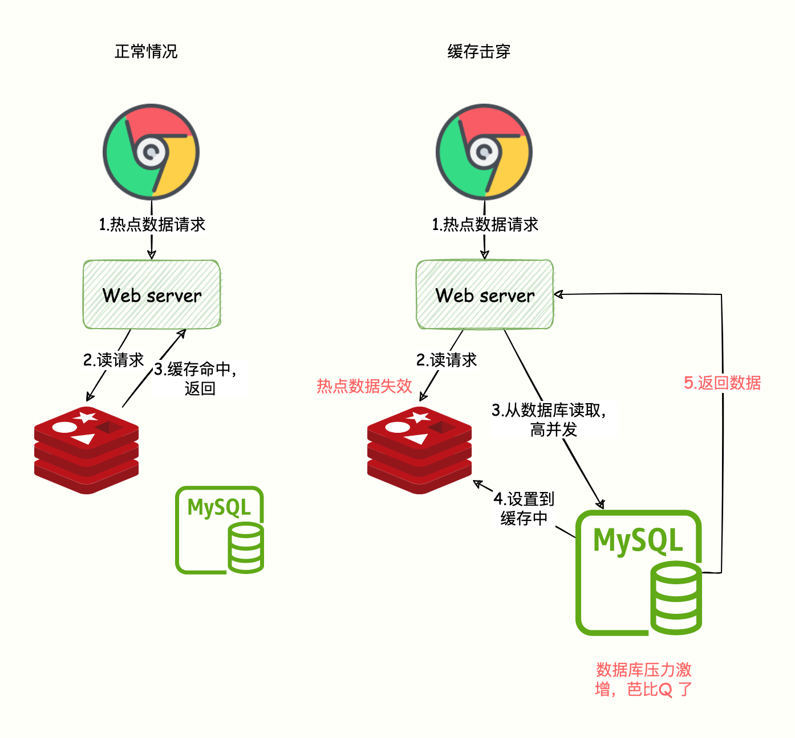
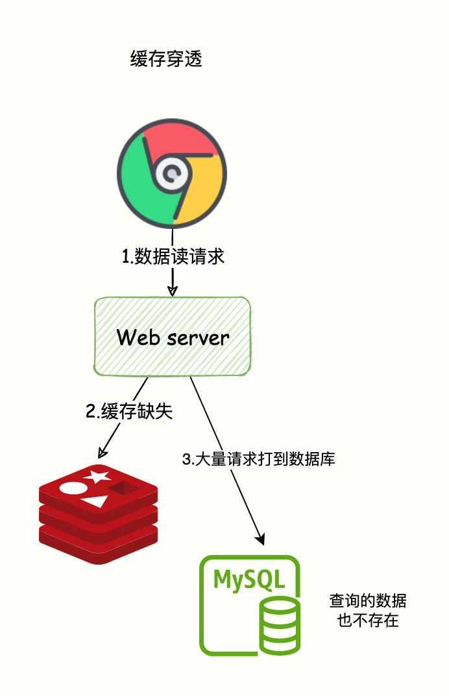
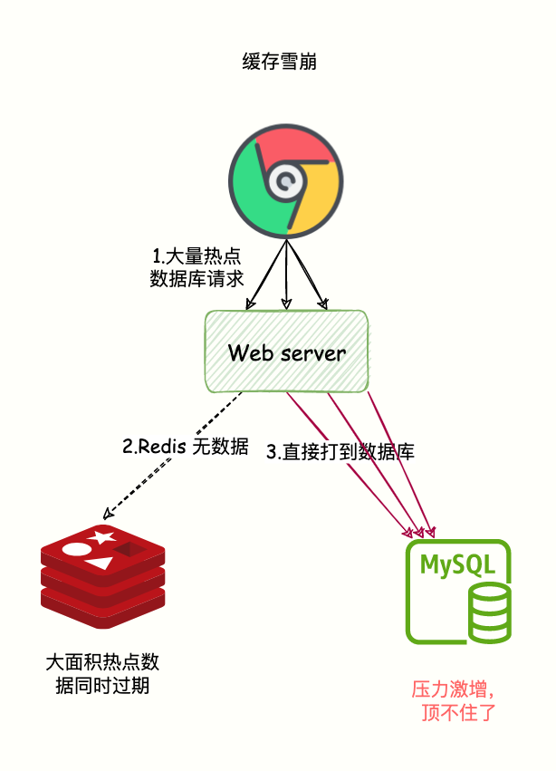
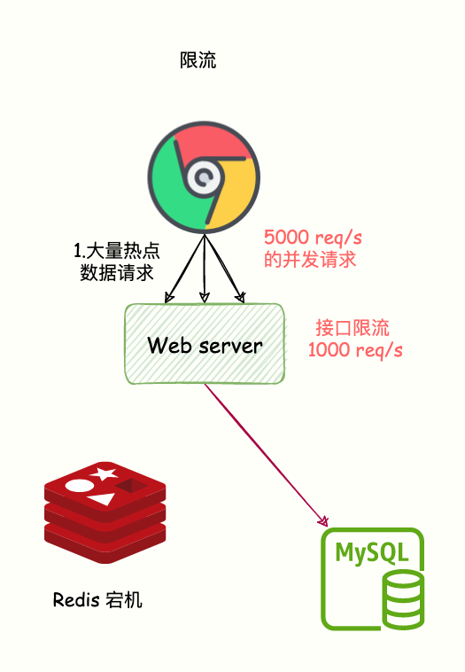

# Spring Boot Redis

## 依赖

```xml
<dependency>
    <groupId>org.springframework.boot</groupId>
    <artifactId>spring-boot-starter-data-redis</artifactId>
</dependency>
```

## StringRedisTemplate

stringRedisTemplate.opsForValue().set(key, value);

value = stringRedisTemplate.opsForValue().get(key);

// 过期时间

stringRedisTemplate.opsForValue().set(key, value, 过期时间, 时间单位);

// 如果有值，不覆盖

stringRedisTemplate.opsForValue().setIfAbsent()

## 典型问题

### 缓存击穿

场景：某个热点数据失效

解决办法：过期时间 = base 时间 + 随机值

避免同一时间，全部过期



### 缓存穿透

key 不存在

缓存设置缺省值 (none)

借助布隆过滤器



### 缓存雪崩

大量数据同时失效






### 总结

- **缓存穿透**：指的是数据库本就没有这个数据，请求直奔数据库，缓存系统形同虚设。
- **缓存击穿（失效）**：指的是数据库有数据，缓存本应该也有数据，但是缓存过期了，Redis 这层流量防护屏障被击穿了，请求直奔数据库。
- **缓存雪崩**：指的是大量的热点数据无法在 Redis 缓存中处理（大面积热点数据缓存失效、Redis 宕机），流量全部打到数据库，导致数据库极大压力。