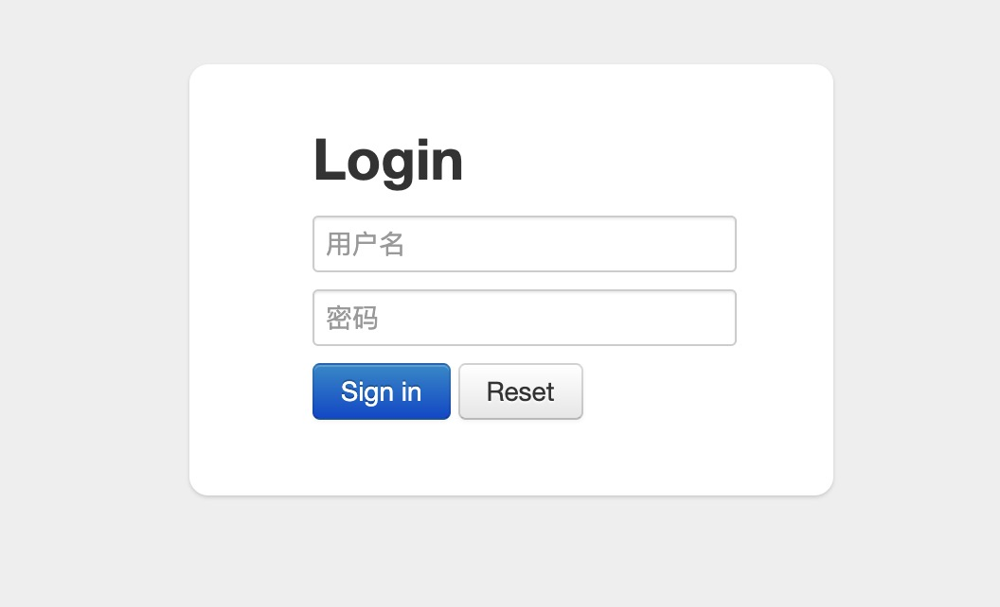
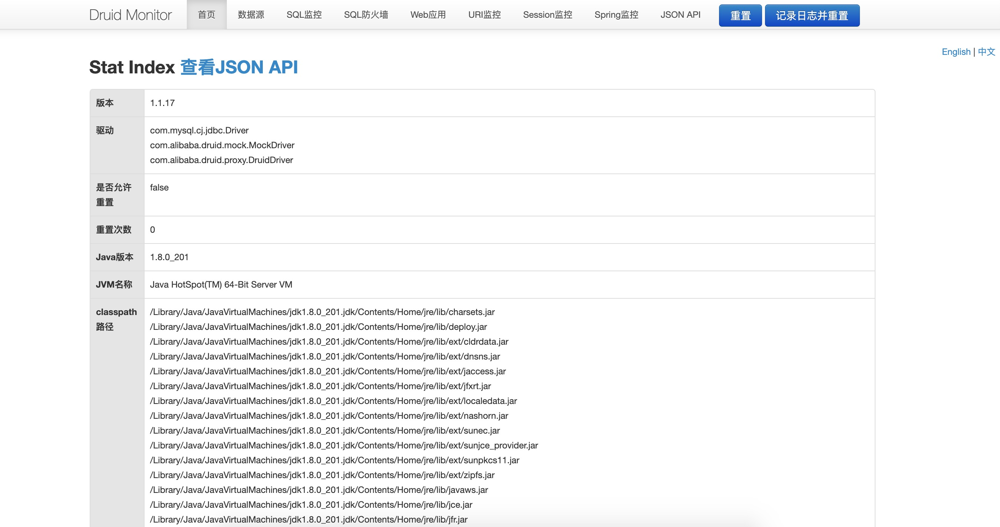
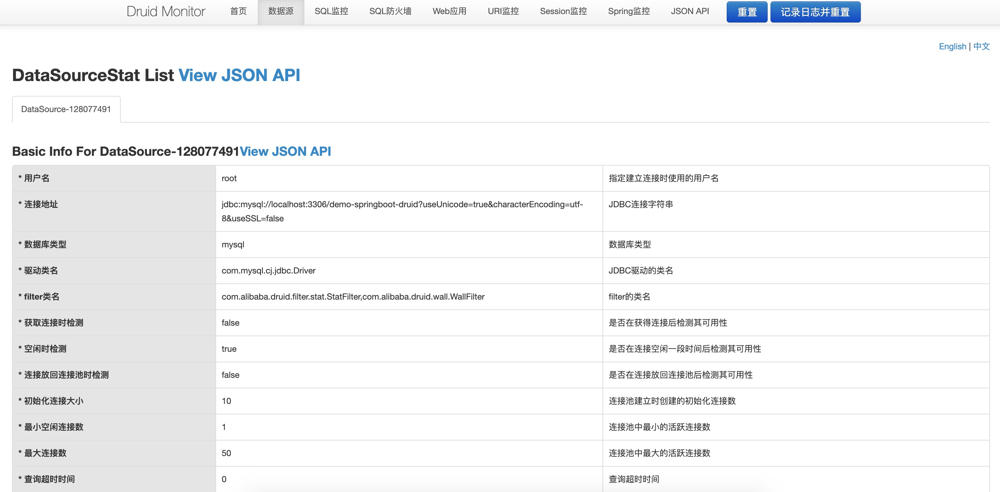
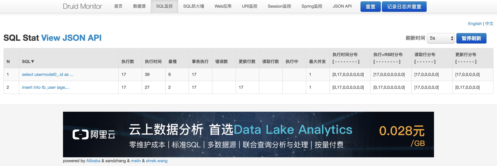
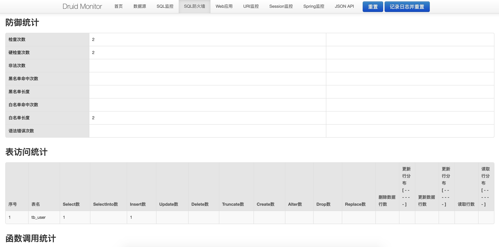
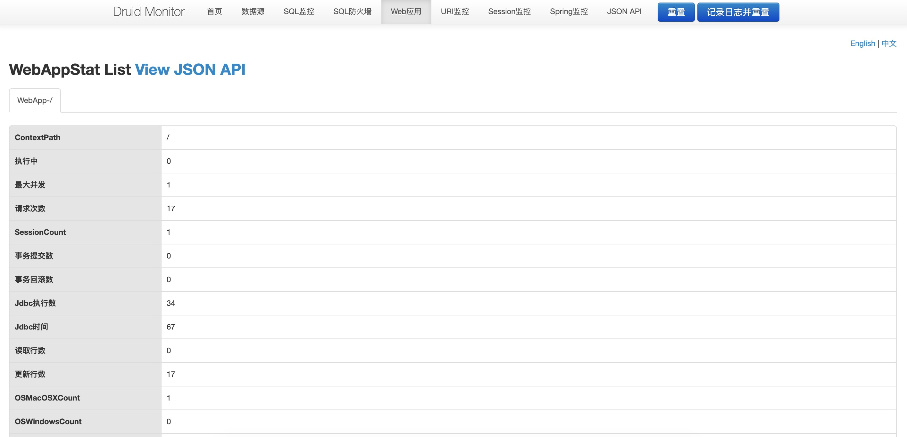
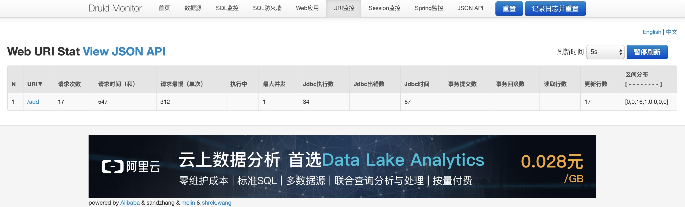
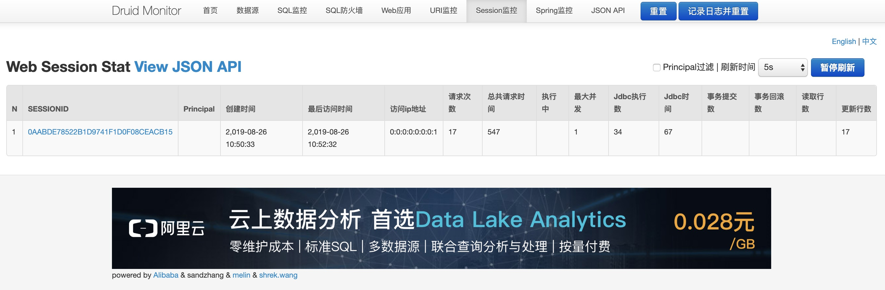

# SpringBoot整合Druid

## SpringBoot 整合 Druid

#### 第一步，添加依赖

```xml
<!-- spring boot druid -->
<dependency>
    <groupId>com.alibaba</groupId>
    <artifactId>druid-spring-boot-starter</artifactId>
    <version>1.1.18</version>
</dependency>
```

#### 第二步，属性配置

```yaml
spring:
  datasource:
    # 数据源名称
    name: druidDataSource
    # 数据源类型
    type: com.alibaba.druid.pool.DruidDataSource
    # 驱动
    driver-class-name: com.mysql.cj.jdbc.Driver
    # URL
    url: jdbc:mysql://localhost:3306/demo-springboot-druid?useUnicode=true&characterEncoding=utf-8&useSSL=false
    # 用户名
    username: root
    # 密码
    password: 123456

    # druid 配置
    druid:
      filters: stat,wall
      # 最大活跃数
      max-active: 50
      # 初始化大小
      initial-size: 10
      # 最大等等时长（毫秒）
      max-wait: 60000
      min-idle: 1
      time-between-eviction-runs-millis: 60000
      min-evictable-idle-time-millis: 300000
      test-while-idle: true
      test-on-borrow: false
      test-on-return: false
      pool-prepared-statements: true
      max-open-prepared-statements: 20
      connection-properties: druid.stat.merggSql=ture;druid.stat.slowSqlMillis=5000
      # 测试查询语句
      validation-query: select 'x'
```

#### 第三步，其他配置

```java
package com.fengwenyi.demo_springboot_druid.config;

import com.alibaba.druid.support.http.StatViewServlet;
import com.alibaba.druid.support.http.WebStatFilter;
import org.springframework.boot.web.servlet.FilterRegistrationBean;
import org.springframework.boot.web.servlet.ServletRegistrationBean;
import org.springframework.context.annotation.Bean;
import org.springframework.context.annotation.Configuration;

/**
 * Druid 配置
 * @author Erwin Feng
 * @since 2019/8/23 18:17
 */
@Configuration
public class DruidConfiguration {

    /**
     * 注册一个StatViewServlet
     *
     * @return
     */
    @Bean
    public ServletRegistrationBean druidStatViewServlet() {
        ServletRegistrationBean servletRegistrationBean = new ServletRegistrationBean(new StatViewServlet(),
                "/druid/*");
        servletRegistrationBean.addInitParameter("loginUsername", "admin");
        servletRegistrationBean.addInitParameter("loginPassword", "admin@1234");
        servletRegistrationBean.addInitParameter("resetEnable", "false");
        return servletRegistrationBean;
    }

    /**
     * 注册一个：filterRegistrationBean
     *
     * @return
     */
    @Bean
    public FilterRegistrationBean druidStatFilter() {
        FilterRegistrationBean filterRegistrationBean = new FilterRegistrationBean(new WebStatFilter());
        // 添加过滤规则.
        filterRegistrationBean.addUrlPatterns("/*");
        // 添加不需要忽略的格式信息.
        filterRegistrationBean.addInitParameter("exclusions", "*.js,*.gif,*.jpg,*.png,*.css,*.ico,/druid/*");
        return filterRegistrationBean;
    }
}
```

## 使用

访问路径：`/druid`

## 预览效果

访问地址：`http://localhost:8080/druid`

#### 登录页



#### 首页



#### 数据源



#### SQL监控



#### SQL防火墙



#### Web应用



#### URI监控



#### SESSION监控




